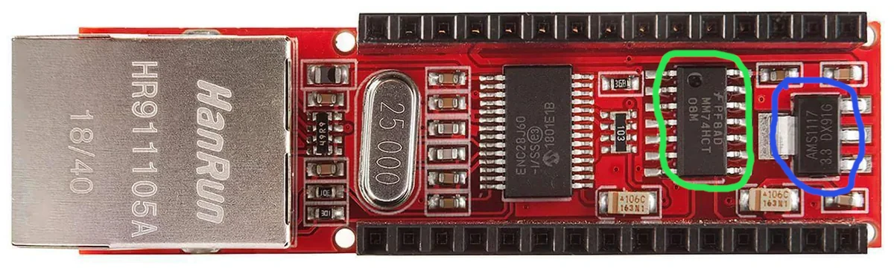
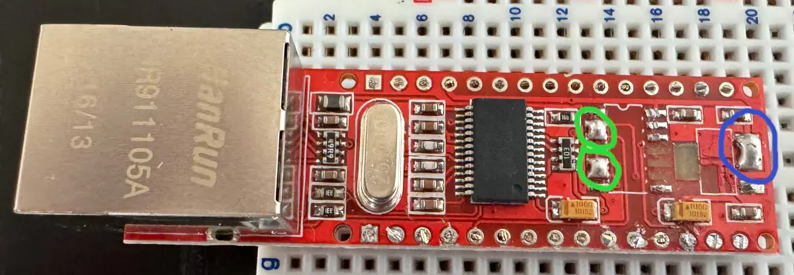

pico-enc28j60
=============

The code in this repository implements an ENC28J60 driver for Raspberry Pi Pico.
The implementation is split into two libraries. A base library that provides the
infrastructure necessary for communication with the device, and a driver for the
FreeRTOS TCP stack. If you happen to use a different stack, you can easily write
your own driver using the base library and taking the FreeRTOS driver as an
example.

RP2040 resources used
---------------------

The base driver uses:

 * 5 GPIOs for communicatio with the device: 4 for SPI and 1 for the interrupt
   signal.
 * The SPI GPIOs are driven by a PIO program that is 17 instructions long and
   uses 1 state machine. The hardware SPI is not used because the device
   commands are variable length.
 * In non-blocking mode, the driver uses 3 DMA channels: 1 for data reception
   and two for scatter-gather transmission.

The FreeRTOS driver spawns a task and requires two task notifications to
function: one for device interrupt and one for DMA completion interrupt.

ENC28J60 Hardware
-----------------

ENC28J60 is a 3.3V chip and there's a bunch of breakout boards available for it
that can be used directly with Pico. There's also an Arduino Nano shield
designed for a 5V operation. Coincidentally, that's the board that has been used
for the development of this driver, but it needs to be modified before it can
be used with Pico.



The AMS1117 voltage regulator (marked blue) used to drop the supply voltage to
3.3V needs to be removed, as we are going to use the Pico's 3.3V output to
supply the device directly. The MM74HCT08M AND gate (marked green) used as a
bufer to raise the voltage of the MOSI and interrupt signals to 5V needs to be
removed as well because Pico can't tolerate GPIO input voltage this high. The
connectors for Vin and Vout pins of the voltage regulator need to be shorted
(marked blue on the picture below) and so do the inputs and outputs of the
AND gates responsible for the MOSI and IRQ signals (marked green).



The relevant pins on this board are:

 * 5V - where we connect the Pico's 3.3V output
 * GND - for ground, all of them are connected and will work fine
 * D13 - SPI clock
 * D12 - MISO
 * D11 - MOSI
 * D10 - Slave Select
 * D2 - Interrupt

Using in a project
------------------

Simply add this repository as a submodule and include it in your master
CMakeListst.txt as follows:

```
set(ENABLE_ENC28J60_FREERTOS_DRIVER FALSE)
add_subdirectory(lib/pico-enc28j60/src)
```

The FreeRTOS driver may be switched on or off.

Base driver setup
-----------------

Driver can be configured through an `enc28j60_config` instance. It can be
created and initialized to defaults using `enc28j60_get_default_config()`. The
struct has the following fields:

 * `pio` - a PIO instance to be used for SPI: `pio0` or `pio1`
 * `sm` - index to the state machine to run the PIO program
 * `miso_pin` - defaults to 16
 * `mosi_pin` - defaults to 17
 * `sclk_pin` - defaults to 18, and `sclk_pin` + 1 = 19 is used for Slave Select
 * `irq_pin` - defaults to 20
 * `dma_irq` - interrupt channel to handle DMA IRQs, defaults to 0
 * `rx_size` - the device has 8kB big buffer that is used for RX and TX queues
               the range from 0 to `rx_size` - 1 will be used for RX, the
               reminder for TX; defaults to `0x1000`
 * `mac_addr` - MAC address of the device
 * `irq_cb` - callback function for the device interrupts
 * `irq_data` - data for the callback
 * `notify` - notification helper described below
 
The DMA notification struct looks as follows:

```c
typedef struct {
    void (*notify)(void *);
    void (*wait)(void *);
    void *data;
} enc28j60_notification;
```

The `notify` function is called in an interrupt context to wake a task that is
going to service the interrupt, while `wait` blocks that task until an interrupt
has been raised. `data` is passed to both functions when they are called.

FreeRTOS setup
--------------

The FreeRTOS driver is normally initialized the following way assuming that most
of the driver configuration options are left at their defaults:

```c
#include <pico/enc28j60-driver.h>
#include <pico/enc28j60-freertos-driver.h>

enc28j60_freertos_interface iface;
static NetworkEndPoint_t endpoint_v4;
static NetworkEndPoint_t endpoint_v6_link;

void setup_network()
{
    memset(&iface, 0, sizeof(enc28j60_freertos_interface));
    enc28j60_config *drv_cfg = enc28j60_get_default_config();
    
    // Choose a MAC address
    memcpy(drv_cfg->mac_addr, mac_addr, 6);

    // Interface setup
    iface.iface.pcName = "e0";
    iface.iface.pvArgument = drv_cfg;
    iface.iface.pfInitialise = enc28j60_freertos_initialize;
    iface.iface.pfOutput = enc28j60_freertos_output_frame;
    iface.iface.pfGetPhyLinkStatus = enc28j60_freertos_get_phy_link_status;
    FreeRTOS_AddNetworkInterface(&iface.iface);

    // IPv4
    memset(&endpoint_v4, 0, sizeof(endpoint_v4));
    // The ip, net_mask, and gateway below may just be zeros if DHCP is used
    FreeRTOS_FillEndPoint(&iface.iface, &endpoint_v4, (uint8_t *)&ip,
                          (uint8_t *)&net_mask, (uint8_t *)&gateway,
                          (uint8_t *)&any_ip, cfg->mac_addr);

    endpoint_v4.bits.bWantDHCP = pdTRUE;

    // IPv6 Link Scope endpoint. A global unicast address requires another
    // endpoint.
    memset(&endpoint_v6_link, 0, sizeof(endpoint_v6_link));
    IPv6_Address_t prefix;
    IPv6_Address_t address;
    FreeRTOS_inet_pton6("fe80::", &prefix);
    memcpy(&address, cfg->ipv6_addr_link, 16);

    FreeRTOS_FillEndPoint_IPv6(&iface.iface, &endpoint_v6_link, &address,
                               &prefix, 64, NULL, NULL, cfg->mac_addr);

    FreeRTOS_IPInit_Multi();
}
```

References
==========

 * [ENC28J60 Data Sheet](https://ww1.microchip.com/downloads/aemDocuments/documents/OTH/ProductDocuments/DataSheets/39662e.pdf)
 * [ENC28J60 Errata](https://ww1.microchip.com/downloads/aemDocuments/documents/OTH/ProductDocuments/Errata/80349c.pdf)
